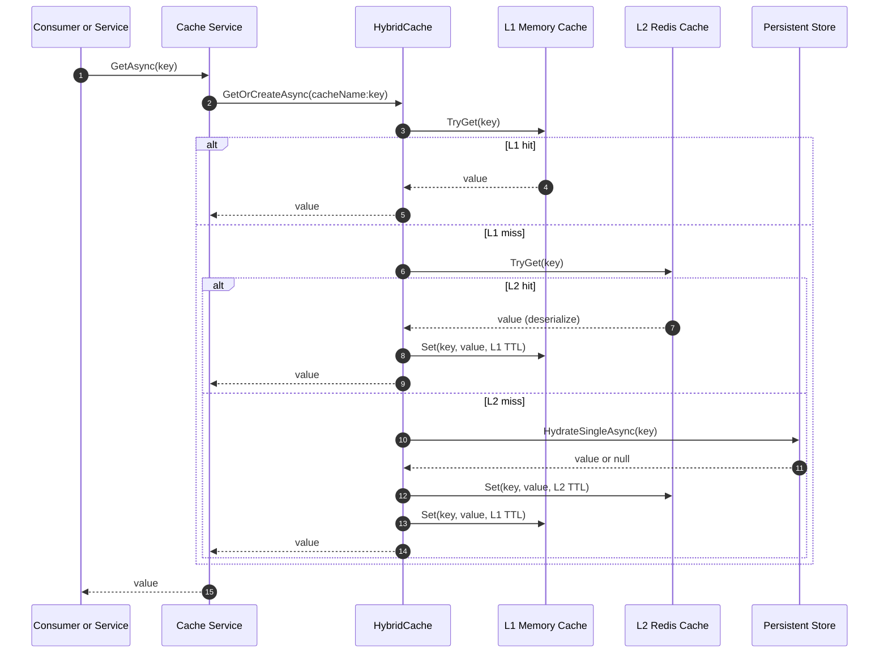
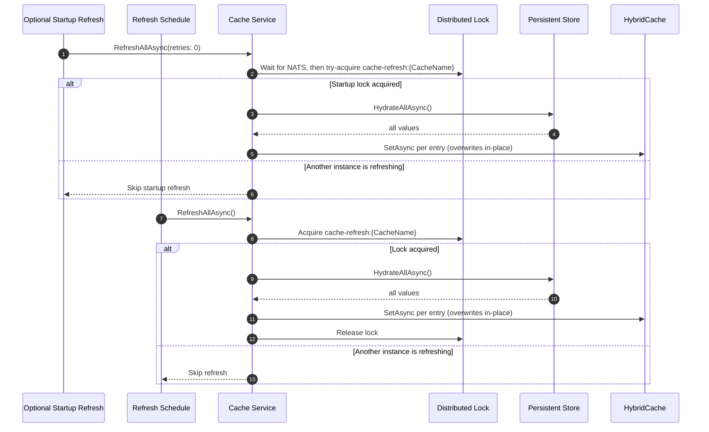

# Multi-Level Caching

`cloops.microservices` provides a cache service abstraction for strongly typed read-through caches. Cache services use .NET `HybridCache`, so every cache gets an in-process L1 cache and can use Redis as an L2 distributed cache when Redis is configured.

The application defines what to cache and how to hydrate it. The framework handles service registration, lookup order, cache population, optional startup refresh, scheduled refresh, distributed refresh locking, and readiness reporting.

In practice, this gives service teams production-grade caching without repetitive plumbing:

- Strongly typed cache services with automatic DI registration and optional interface aliases.
- Fast L1 reads by default, Redis-backed L2 sharing when configured, and safe per-key read-through hydration.
- Built-in TTL configuration, null-result caching, startup warmup, cron refresh, and distributed refresh locking.
- Developer-friendly defaults that keep cache code focused on source-of-truth hydration instead of wiring, coordination, and lifecycle concerns.

## Concepts

| Term        | Meaning                                                                                                  |
| ----------- | -------------------------------------------------------------------------------------------------------- |
| `L1 cache`  | In-process memory cache owned by the current service instance. Fastest lookup, but local to one process. |
| `L2 cache`  | Distributed cache shared across service instances. Redis is the intended backing store.                  |
| Hydration   | Loading cache values from the persistent source of truth, such as SQL, another service, or API.          |
| Cache key   | A stable key that identifies one cache entry within a cache service.                                     |
| Cache value | The strongly typed object stored by a cache service. Each cache service owns one value type.             |

The SDK registers `HybridCache` for all apps. Redis integration uses `Microsoft.Extensions.Caching.StackExchangeRedis`; when Redis is not configured, `HybridCache` still provides L1 caching and stampede protection.

## Configuration

Redis is configured from environment variables:

| Variable                  | Required | Meaning                                                                                                                              |
| ------------------------- | -------- | ------------------------------------------------------------------------------------------------------------------------------------ |
| `REDIS_CONNECTION_STRING` | No       | Enables Redis as HybridCache's distributed L2 cache. When not set, the cache runs in L1-only mode.                                   |
| `REDIS_INSTANCE_NAME`     | No       | Redis key prefix. Defaults to `{AssemblyName}:` when not set, so multiple apps can share a Redis instance without colliding on keys. |

If `REDIS_CONNECTION_STRING` is empty, cache services run in L1-only mode. If Redis is configured, the SDK registers `IDistributedCache` with StackExchange.Redis and `HybridCache` uses it as the secondary cache.

## Registering Cache Services

Create cache service classes in a namespace ending with `.Cache`, inherit from `BaseCacheService<TValue>`, and decorate with `[CacheConfig(...)]`. The SDK scans the application assembly for these types and registers each one as:

1. The concrete cache service type (singleton).
2. A same-namespace interface, if present (alias to the singleton).
3. An `IHostedService` (so cron-based and optional startup refresh run as part of the host lifecycle).

```csharp
using CLOOPS.microservices;
using Microsoft.Extensions.Caching.Hybrid;
using Microsoft.Extensions.Logging;

namespace my.app.Cache;

public interface IPatientCache
{
    Task<Patient?> GetAsync(string patientId, CancellationToken ct = default);
}

[CacheConfig(
    name: "patient-cache",
    l1Ttl: "00:05:00",
    l2Ttl: "01:00:00",
    RefreshCron = "0 */15 * * * *")]
public class PatientCacheService : BaseCacheService<Patient>, IPatientCache
{
    // source of truth. may be some db for patients
    private readonly PatientRepository patients;

    public PatientCacheService(IServiceProvider serviceProvider, PatientRepository patients)
        : base(serviceProvider)
    {
        this.patients = patients;
    }

    protected override Task<Patient?> HydrateSingleAsync(string key, CancellationToken ct)
    {
        // Return null when the patient does not exist in the source of truth.
        // Throw only for system errors (network, DB) — thrown exceptions are NOT cached.
        return patients.GetPatientAsync(key, ct);
    }

    protected override async Task<IReadOnlyDictionary<string, Patient>> HydrateAllAsync(CancellationToken ct)
    {
        var allPatients = await patients.GetAllPatientsAsync(ct);
        return allPatients.ToDictionary(patient => patient.Id);
    }
}
```

Application code consumes cache services through dependency injection:

```csharp
public class PatientConsumer
{
    private readonly IPatientCache patients;

    public PatientConsumer(IPatientCache patients)
    {
        this.patients = patients;
    }

    public async Task HandleAsync(string patientId, CancellationToken ct)
    {
        var patient = await patients.GetAsync(patientId, ct);
        if (patient is null)
        {
            // Caller decides what "not found" means.
            return;
        }
        // Use the hydrated patient in business logic.
    }
}
```

### Testing Cache Consumers

For unit tests, depend on the cache-specific interface (for example, `IPatientCache`) and mock or fake that interface. Avoid constructing `BaseCacheService<TValue>` in consumer tests; that pulls in `HybridCache`, TTL configuration, optional Redis/NATS behavior, and hosted-service lifecycle concerns that belong in integration tests.

## `[CacheConfig]` Attribute

`CacheConfigAttribute` is **required** on every cache service. It carries all cache-level configuration:

| Property           | Required | Meaning                                                                                                                  |
| ------------------ | -------- | ------------------------------------------------------------------------------------------------------------------------ |
| `name` (ctor arg)  | Yes      | Stable cache name used as the key prefix and HybridCache tag. Cannot contain `:`. Must be unique across the application. |
| `l1Ttl` (ctor arg) | Yes      | Local in-process TTL, as a `TimeSpan` string (e.g. `"00:05:00"` for 5 minutes).                                          |
| `l2Ttl` (ctor arg) | Yes      | Distributed TTL, as a `TimeSpan` string (e.g. `"01:00:00"` for 1 hour).                                                  |
| `RefreshCron`      | No       | Cron expression that periodically triggers `HydrateAllAsync`. Requires the cache service to override `HydrateAllAsync`.  |
| `RefreshOnStartup` | No       | Defaults to `false`. When `true`, one best-effort bulk refresh runs during host startup. See _Startup behavior_ below.   |

Cache name uniqueness is validated at startup; two cache services sharing a name throws `InvalidOperationException` before the host runs.

## Cache Service API

Each cache service must:

1. Apply `[CacheConfig(...)]` with `name`, `l1Ttl`, `l2Ttl`.
2. Override `HydrateSingleAsync(string key, CancellationToken ct)` — single-key source-of-truth lookup.
3. Optionally override `HydrateAllAsync(CancellationToken ct)` — bulk source-of-truth lookup. Required for `RefreshCron` / `RefreshOnStartup` / explicit `RefreshAllAsync` calls.

`BaseCacheService<TValue>` exposes:

| Method                                      | Behavior                                                                                                                                |
| ------------------------------------------- | --------------------------------------------------------------------------------------------------------------------------------------- |
| `GetAsync(key, ct)`                         | Reads L1 → L2 → `HydrateSingleAsync`. Returns `null` when the source of truth has no value (and caches that absence per `L2Ttl`).       |
| `GetAsync(key, CacheGetOptions, ct)`        | Same as above, but accepts per-call TTL overrides (`L1Ttl`, `L2Ttl`) for this single lookup. Useful for "this entry is volatile" cases. |
| `GetRequiredAsync(key, ct)`                 | Returns the value or throws `KeyNotFoundException` if the source reports it as absent. Use only when absence is an error.               |
| `SetAsync(key, value, ct)`                  | Writes a value to L1 and L2.                                                                                                            |
| `RemoveAsync(key, ct)`                      | Removes one value from L1 and L2.                                                                                                       |
| `RefreshAllAsync(retries, throwOnFail, ct)` | Bulk-hydrates from the source of truth under a NATS distributed lock. See _Startup and refresh flow_ below.                             |

### Nullability and "not found"

`GetAsync` returns `Task<TValue?>`. The contract is intentionally explicit:

- `HydrateSingleAsync` returns `null` when the entry does not exist in the source of truth. `HybridCache` caches the absence like any other value, so subsequent reads stay fast and don't hammer the source.
- `HydrateSingleAsync` throws only for _system errors_ — network failures, DB connectivity, malformed responses, etc. Thrown exceptions are NOT cached; every subsequent lookup of that key will retry.
- Callers that want "fail loud if missing" semantics can use `GetRequiredAsync`, which throws `KeyNotFoundException` on a `null` result.

Avoid throwing for "not found" inside `HydrateSingleAsync` — exception construction and unwinding is dramatically more expensive than returning `null`, and `HybridCache` won't cache the throw, which defeats the cache's purpose.

Prefer reference types or nullable value types for cache values that need an explicit "not found" state. `GetRequiredAsync` only treats `null` as missing; `default(int)`, `default(Guid)`, and other non-null value defaults are returned as ordinary cached values.

### Per-call TTL overrides

Some entries within a cache are more volatile than others (e.g. a record in a `pending` state vs. a stable record). Pass a `CacheGetOptions` to shorten TTL for that single lookup:

```csharp
var pendingOrder = await orders.GetAsync(
    orderId,
    new CacheGetOptions { L1Ttl = TimeSpan.FromSeconds(15), L2Ttl = TimeSpan.FromMinutes(1) },
    ct);
```

When `CacheGetOptions` is `null` (or both TTLs are `null`), the cache service's default TTLs are used and no per-call options object is allocated.

## Lookup Flow

Cache reads are read-through. Callers ask the cache service for a key and do not need to know whether the value came from L1, L2, or the persistent store.



`HybridCache` ensures only one concurrent caller for a **given key** calls the hydration callback; other concurrent callers wait for the same result. For bulk updates, we have our own distributed lock gate to protect against multiple pods trying to update L2 cache at the same time.

## Startup and Refresh Flow

Bulk hydration is optional. It is useful for small reference datasets, heavily read data, or systems where cold-start latency matters.

By default, startup does not refresh L2 from the source of truth. This avoids a rolling restart of many pods causing repeated database hydration when Redis already has healthy L2 data.

Startup also does not eagerly warm L1 from L2. After a pod restart, L1 is repopulated on demand: the first `GetAsync` for a key checks Redis L2 and promotes that value into local L1 when present. If L2 is missing or expired, the normal single-key hydration path loads from the source of truth.

### `RefreshOnStartup = true`

`RefreshOnStartup` is available for rare caches where a best-effort startup fill is useful — first deploys, Redis flush recovery, or small reference datasets that should be ready before traffic. When enabled:

- The cache service must override `HydrateAllAsync` (validated at startup).
- The cache service **blocks** its `StartAsync` until hydration completes (or returns early because another instance holds the refresh lock).
- The SDK waits up to 60 seconds for a configured NATS client to connect before attempting the distributed lock. If no NATS client is registered, refresh runs without a distributed lock and logs a warning.

ASP.NET Core arranges `IHostedService` startup so that **all user-registered hosted services run before `GenericWebHostService` (Kestrel) binds to its port** (see [PR dotnet/aspnetcore#36122](https://github.com/dotnet/aspnetcore/pull/36122)). The practical consequence: while a cache is hydrating during `StartAsync`, Kestrel is not yet listening, so external probes get TCP "connection refused" and Kubernetes will not route traffic to the pod. The SDK does not perform an explicit cache-readiness check in `/readyz`; cache startup readiness happens out of the box through hosted-service startup ordering.

Use explicit `RefreshAllAsync(retries: ..., throwOnFail: true, ...)` calls when an operation needs stronger guarantees and should fail loudly if the refresh cannot complete.

Scheduled refresh requires both `HydrateAllAsync` and `RefreshCron`. If `RefreshCron` is configured without bulk hydration, startup fails with a configuration error.



Distributed locks use the existing NATS JetStream lock support. If NATS is not configured, the cache service logs a warning and performs refresh without a distributed lock.

## Key Structure

Cache keys include the cache service name and entry key:

```text
{cache-service-name}:{key-name}
```

Examples:

```text
patient-cache:12345
bills-cache:invoice-987
```

Cache names and entry keys cannot contain `:`. Each entry also receives a `HybridCache` tag equal to `name`. The framework reserves the tag for future use; the bulk refresh path intentionally does _not_ call `RemoveByTagAsync` — see _Design Notes_ for why.

## Design Notes

### TTL sizing

For scheduled bulk caches, choose TTLs so `L1Ttl < refresh cron interval < L2Ttl`. Short L1 lets local entries turn over between refreshes (which matters because of cross-pod L1 staleness — see below); long L2 keeps shared data available for pod restarts and missed refresh cycles.

### Cross-pod L1 staleness

`HybridCache` only invalidates the L1 cache on the pod that performed the operation. Per the [official documentation](https://learn.microsoft.com/aspnet/core/performance/caching/hybrid):

> When invalidating cache entries by key or by tags, they're invalidated in the current server and in the secondary out-of-process storage. However, the in-memory cache in other servers isn't affected.

The practical consequences for cloops caches:

- When one pod runs `RefreshAllAsync`, it writes fresh values to L2 and refreshes its own L1. Other pods continue serving stale L1 data until their `L1Ttl` expires for each key.
- This is a fundamental property of HybridCache without a backplane. Pick a small enough `L1Ttl` that per-pod L1 staleness is acceptable for your workload.

### Why bulk refresh does not `RemoveByTagAsync`

An earlier design called `RemoveByTagAsync` before writing the new values. This created a race window: between the tag invalidation and each subsequent `SetAsync`, reads for not-yet-rewritten keys fell through to `HydrateSingleAsync`. Under heavy read traffic this caused stampedes against the source of truth.

The current implementation simply iterates and calls `SetAsync` for each refreshed key. Reads remain consistent throughout the refresh (they see either the old value or the new value, never a forced miss). The trade-off:

- **Entries that exist in both the old and new dataset:** overwritten in place. No race, no stampede.
- **Entries that exist only in the _new_ dataset:** added by `SetAsync`. No race.
- **Entries that exist only in the _old_ dataset** (i.e. removed from the source of truth): remain in L2 until their natural `L2Ttl` expiration. Pods that have them in L1 will continue serving them until `L1Ttl` expires too.

For most read-through caches this is acceptable. If your domain absolutely cannot tolerate serving removed entries, use `RemoveAsync(key, ct)` explicitly when the upstream change event fires, or shorten `L2Ttl`. There is also a known [HybridCache local tag-invalidation caching limitation](https://github.com/dotnet/extensions/issues/7411) that would have caused the same staleness even with `RemoveByTagAsync`, so the simpler write-only path is the better default.

### L2 hit deserialization cost

An L2 hit is **not** free. Each L2 hit deserializes the value (JSON by default) and copies bytes off the Redis socket. For large or deeply nested objects this dominates the cost, and is one of the practical reasons to keep `L1Ttl` non-trivial for hot keys — repeat reads of a hot key under L1 cost almost nothing.

### Type ownership

A cache service should own exactly one value type to keep serialization, TTL, and hydration behavior predictable.

### Hydration semantics

Hydration callbacks should treat the persistent store as the source of truth. `HydrateSingleAsync` should return `null` for "not present" and throw only for system errors. Throw-on-not-found defeats the cache's purpose because exceptions are not cached.

### Refresh philosophy

Cron refresh is the normal path that hydrates L2 from the source of truth. Startup should normally avoid bulk hydration; L1 fills from L2 on demand as keys are read. Reach for `RefreshOnStartup` only when cold-cache latency is genuinely unacceptable for the first traffic after a deploy.
